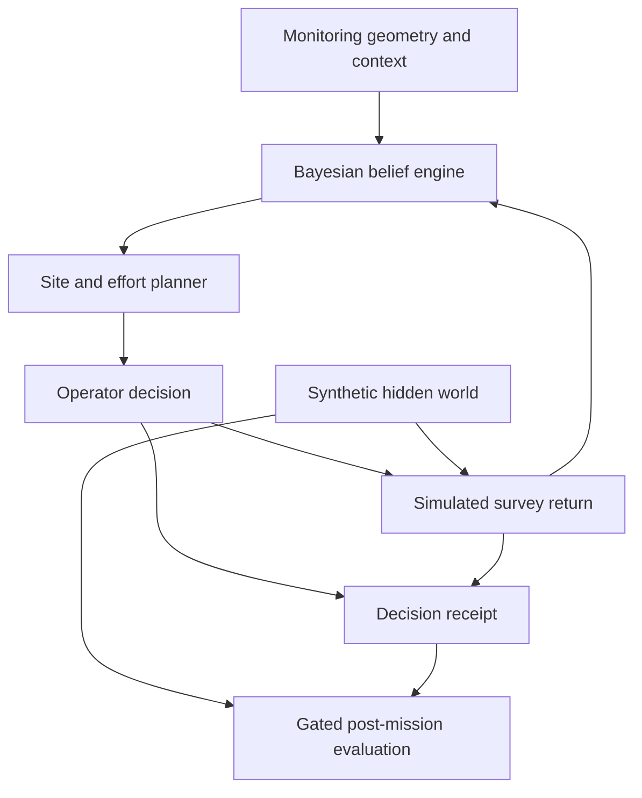

# Architecture and integration boundary

## Data flow

`Environment` owns the synthetic hidden world. Public state and exported graph state contain observable information. The Bayesian engine represents ecological hypotheses jointly with detectability support; the planner acts on that belief. Complete hidden truth is exposed only after budget exhaustion and reveal. This is a modeling/evaluation boundary, not protection against someone reconstructing deterministic cases from their source and seeds.

## Important modules

| Area | Module | Contract |
| --- | --- | --- |
| State and actions | `models.py` | Immutable site/edge, observation, public-state and mission types |
| Simulation | `environment.py`, `world_models.py` | Hidden ecological extent and effort-conditioned survey return |
| Spatial inference | `spatial_belief.py` | Posterior update over ecological/detectability hypotheses |
| Observable features | `graph_state.py` | Planner-facing graph representation |
| Product policy | `mission_control.py` | Current heuristic, 100-case UI adapter and paired static comparator |
| Mission orchestration | `mission_loop.py`, `spatial_mission_loop.py` | Budget conservation, plan/execute/update and reveal gates |
| Optional learning | `rl/` | GNN actor-critic, training, checkpointing and benchmarks |
| Buyer evaluation | `live_audit.py`, `cli.py` | Reproducible case rows, summary and local demo launcher |
| Web boundary | `web_app.py`, `sessions.py`, `web/` | Strict request contracts, serialized per-session operations and UI |
| Distribution assets | `resources.py`, `assets/` | Identical frozen checkout/wheel fixtures with SHA-256 receipts |

## Modeling assumptions

At an occupied site, `P(no detection | effort=e) = (1-q)^e`. The default UI uses detectability support `{0.05, 0.10, 0.20}`, an 18-unit total effort budget and choices `{1, 3, 6}`. Effort is an abstract survey resource; a monetary or crew-time interpretation requires calibration. Current demo outcomes use deterministic potential-outcome uniforms by case/site for paired comparisons. Revisits can share those underlying uniforms; the 100-case default adaptive audit contains no revisits.

The site graph is derived, not an official monitoring-network graph or a validated dispersal model. Historical graph edge files include water-route proxies; the incident constructor uses straight-line site distance for the frozen context contract. Nearby graph sites are not a verified spread pathway.

## Buyer integration

The delivered HTTP API drives **simulated evaluation incidents**. `/api/deploy` executes a simulated survey; it does not ingest a real team's observations or dispatch a field team. The UI has no customer authentication or real incident database.

A live integration should supply authoritative sites/edges, observations with documented effort and protocol, calibrated detectability, resource constraints and a durable incident record. Adapt the inference and planner interfaces with an observation adapter, then validate against known data and existing operational practice. Separate simulator-only evaluation from operational observations. Acceptance tests must prove that live adapters preserve effort conservation and the information boundary.

The default UI uses `MissionControlFrontierPlanner` (the live effort-aware heuristic). The optional `SiteEffortRoundPolicy` is a different planner; trained weights must be supplied, fingerprinted and evaluated before substituting it. Changing planners or thresholds invalidates performance claims from earlier configurations.

## Runtime boundary

One process hosts a bounded in-memory session store: 16 browser-profile sessions, each expiring after one idle hour. Each session's requests are serialized; different sessions have separate incidents. Requests using stale `expected_round` are rejected without spending additional effort. Sessions are not accounts and are not durable. Run a single worker; horizontal scaling requires shared state and a designed identity boundary.
